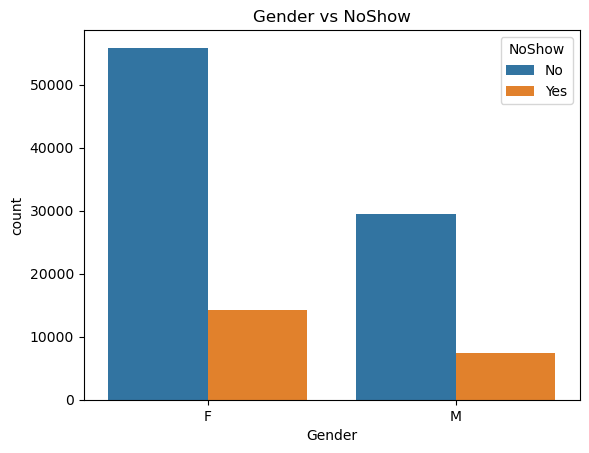
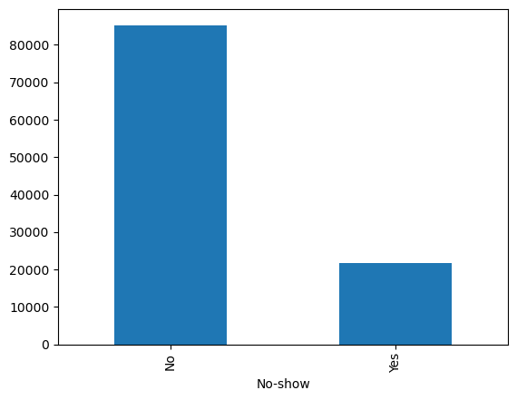
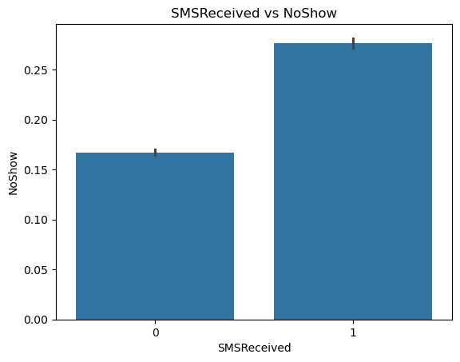

# 🏥 تحليل غياب المرضى عن المواعيد الطبية

## 📌 فكرة المشروع

يهدف هذا المشروع إلى تحليل بيانات مواعيد المرضى لمعرفة الأسباب التي تؤدي إلى عدم حضورهم للموعد الطبي.
تم استخدام التحليل الاستكشافي للبيانات لفهم الأنماط السلوكية والعوامل التي قد تساعد الجهات الصحية على تحسين جدولة المواعيد.

---

## 🎯 هدف التحليل

الإجابة على مجموعة من الأسئلة المهمة مثل:

* هل تؤثر مدة الانتظار بين الحجز والموعد على الحضور؟
* هل تختلف نسبة الغياب حسب يوم الأسبوع؟
* ما الأنماط الظاهرة في بيانات المرضى؟

---

## 🧹 تنظيف وتجهيز البيانات

تم تنفيذ عدة خطوات لتحسين جودة البيانات:

* تحويل أعمدة التواريخ إلى صيغة مناسبة للتحليل
* إنشاء متغير **WaitingDays** لقياس مدة الانتظار
* معالجة القيم غير المنطقية
* تنظيم أسماء الأعمدة

---

## 📊 التحليل الاستكشافي للبيانات

شمل التحليل:

* دراسة توزيع الأعمار
* تحليل تأثير مدة الانتظار
* مقارنة الحضور والغياب عبر أيام الأسبوع
* استخدام الرسومات لفهم الأنماط بشكل بصري

أظهر التحليل أن مدة الانتظار تعتبر من أهم العوامل المرتبطة بعدم حضور المرضى.

---

## 💡 أهم الاستنتاجات

* زيادة مدة الانتظار ترتبط بارتفاع نسبة الغياب.
* بعض أيام الأسبوع تظهر اختلافًا في معدلات الحضور.
* التحليل البصري ساعد على فهم سلوك المرضى بشكل أوضح.

---

## 🛠️ الأدوات المستخدمة

* Python
* Pandas
* Matplotlib
* Seaborn
* Jupyter Notebook

---
### 📊 أمثلة من الرسومات

## 👩‍💻 ماذا تعلمت من المشروع

* تنظيم خطوات تحليل البيانات بشكل واضح.
* تحويل البيانات إلى استنتاجات قابلة للفهم.
* كتابة مشروع تحليل بيانات باللغة العربية.
